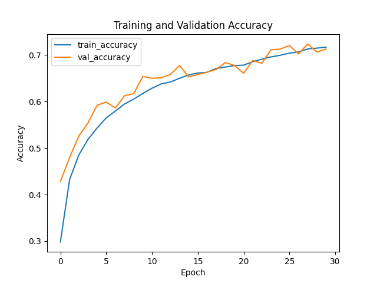
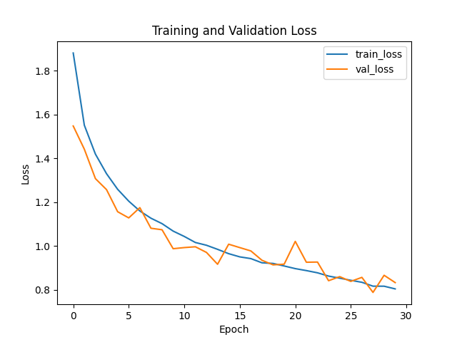
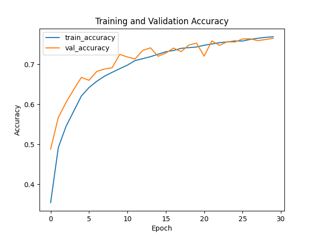
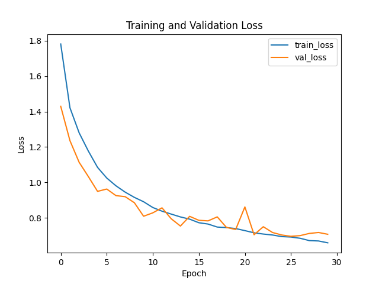

# CNN with Squeeze-and-Excitation Blocks

This project enhances the performance of Convolutional Neural Networks (CNNs) by integrating **Squeeze-and-Excitation (SE) blocks**. SE blocks allow the network to recalibrate channel-wise feature responses adaptively, enabling the model to focus on more informative features. The model is trained and evaluated on the **CIFAR-10** dataset.

## Key Improvements

- **Accuracy**: Increased from **71%** to **77%**.
- **Loss**: Decreased from **0.8690** to **0.7036**.

The integration of SE blocks improves the learning capacity of the network, especially in extracting relevant features across the different channels, allowing the model to better capture the underlying patterns in the data.

## Table of Contents

1. [Project Overview](#project-overview)
2. [Key Improvements](#key-improvements)
3. [Directory Structure](#directory-structure)
4. [Setup and Installation](#setup-and-installation)
5. [Usage](#usage)
6. [Model Training](#model-training)
7. [Model Evaluation](#model-evaluation)
8. [Results](#results)
9. [License](#license)

## Project Overview

This project demonstrates the integration of Squeeze-and-Excitation (SE) blocks into CNN architectures. SE blocks improve the representational capacity of CNNs by recalibrating channel-wise feature maps, which leads to improved performance on image classification tasks. The CIFAR-10 dataset, which consists of 60,000 32x32 color images in 10 classes, is used for training and evaluation.

## Directory Structure

The directory structure of the project is organized as follows:

```plaintext
cnn_with_se_blocks/
│
├── data/                      # Contains CIFAR-10 dataset
│   ├── cifar-10-batches-py/   # Dataset files in pickle format
│  
├── config/                    # Configuration files
│   └── config.py              # Configuration parameters for training
│
├── models/                    # Model architecture files
│   ├── baseline_cnn.py        # Baseline CNN architecture (without SE blocks)
│   ├── se_block.py            # Squeeze-and-Excitation block definition
│   └── enhanced_cnn.py        # CNN with SE blocks integrated
│
├── scripts/                   # Scripts for training, evaluation, and utility functions
│   ├── train.py               # Script to train the model
│   ├── evaluate.py            # Script to evaluate model performance
│   ├── utils.py               # Utility functions for data processing and training
│
├── results/                   # Folder to store model checkpoints and logs
│   ├── checkpoints/           # Model checkpoints during training
│   │   ├── baseline_model/    # Checkpoints for the baseline CNN
│   │   │   └── best_model.h5  # Best model checkpoint for baseline CNN
│   │   ├── enhanced_model/    # Checkpoints for the enhanced CNN with SE blocks
│   │   │   └── best_model.h5  # Best model checkpoint for enhanced CNN
│
├── requirements.txt           # List of Python dependencies
├── README.md                  # Project documentation
└── main.py                    # Main entry point for running the training/evaluation process
```

## Setup and Installation

To set up the project, follow these steps:

1. **Clone the repository:**

    ```bash
    git clone https://github.com/Sooma-hey/cnn_with_se_blocks.git
    cd cnn_with_se_blocks
    ```

2. **Install the required dependencies:**

    ```bash
    pip install -r requirements.txt
    ```


## Usage

### Model Training

To train the baseline CNN model (without SE blocks), run the following command:

```bash
python main.py --mode train --model_type baseline
```

To train the CNN model with SE blocks, use:

```bash
python main.py --mode train --model_type enhanced
```

### Model Evaluation

To evaluate the trained baseline model:

```bash
python main.py --mode evaluate --model_type baseline
```

To evaluate the trained enhanced model:

```bash
python main.py --mode evaluate --model_type enhanced
```

## Results

The integration of SE blocks led to a significant improvement in model performance:

| Model              | Accuracy | Loss  |
|-------------------|----------|-------|
| Baseline CNN      | 71%      | 0.8690 |
| CNN with SE Blocks | 77%      | 0.7036 |

Model size barely changed from 677.45 KB to 680.21 KB

### **Model Comparison: Baseline vs Enhanced**

Below are the **Accuracy** and **Loss** comparisons for both the **Baseline** and **Enhanced** models:

#### Baseline Model
  

#### Enhanced Model
  

## License

This project is licensed under the Apache License 2.0 License - see the [LICENSE](LICENSE) file for details.
